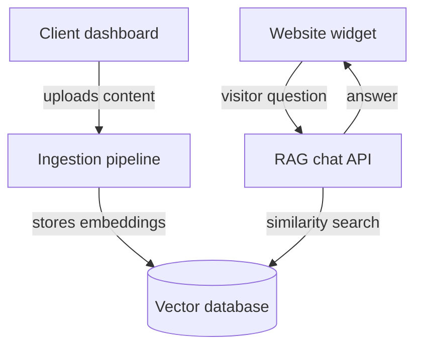

# AI Bot-as-a-Service Platform — High-Level Design (HLD)

**Author:** Jagat Pal Singh | DVIO Digital Pvt. Ltd. **Status:** Draft v1 — architecture stage, before implementation

---

## 1. Purpose of this document

This HLD describes *how* the platform will be built — the major components, how data moves through the system, how clients stay isolated from each other, and the key technical decisions. It intentionally stays at the architecture level: no code, no low-level implementation details. Those come later, once this design is agreed on.

---

## 2. Goals and non-goals

**Goals**

- Any DVIO client can upload their own content and get a working support chatbot, without a developer manually building it each time
- One platform serves many clients (multi-tenant), not one deployment per client
- Answers must come only from the client's own uploaded content — no hallucinated or generic answers
- Integration into a client's website should take one script tag, no code changes on their end

**Non-goals (for v1)**

- No voice/phone support — text chat only
- No support for structured data sources (databases, CRMs) as knowledge input — documents and web pages only
- No custom LLM fine-tuning per client — all clients share the same underlying model, personalized only through their own content
- No white-labelling / custom domains for the widget in the MVP (kept on the roadmap — planned for phase 2)

---

## 3. System overview

The platform has five major components. Two run **once per client** (setup time), and two run **on every visitor interaction** (real time). This distinction drives a lot of the design — the real-time path needs to be fast and cheap; the setup path can be slower.



| # | Component | Runs | Responsibility |
| --- | --- | --- | --- |
| 1 | Client dashboard | Setup time | Client signs up, uploads docs, configures bot, gets embed code |
| 2 | Ingestion pipeline | Setup time | Converts raw content into searchable chunks + embeddings |
| 3 | Vector database | Always-on storage | Stores embeddings, supports similarity search |
| 4 | RAG chat API | Real time (per question) | Finds relevant content, asks the LLM to answer |
| 5 | Website widget | Real time (per visitor) | Chat UI embedded on the client's site |

---

## 4. Component breakdown

### 4.1 Client dashboard

- Where a DVIO client's team logs in to manage their bot(s)
- Responsibilities: authentication, organization/team management, document upload, bot configuration (name, tone, allowed domains), viewing chat history/analytics, generating the embed snippet
- One client organization can have multiple bots (e.g., a "Support Bot" and a "Sales Bot")

### 4.2 Ingestion pipeline

- Triggered whenever a client uploads or updates content
- Responsibilities: extract text from PDFs/web pages/FAQs → split into small chunks → convert each chunk into an embedding (a numeric representation of meaning) → store in the vector database
- Runs asynchronously (as a background job), since processing large documents can take time — the dashboard should show "processing" → "ready" status rather than blocking the client

### 4.3 Vector database

- Stores every chunk's embedding, tagged with which bot/client it belongs to
- Supports similarity search: "given this visitor's question, find the most relevant stored chunks"
- Chosen approach: PostgreSQL with the `pgvector` extension — since Postgres is already in DVIO's stack, this avoids introducing and operating a separate specialized database

### 4.4 RAG chat API

- The real-time brain of the system. For every visitor question:
  1. Convert the question into an embedding
  2. Search the vector database for the most relevant chunks belonging to that specific bot
  3. Pass those chunks + the question to an LLM (Claude/GPT) with instructions to answer *only* using the given content
  4. Return the answer to the widget
- This is the component that runs most frequently and has the tightest latency/cost requirements — it needs to respond in a couple of seconds, for every single message, across every client

### 4.5 Website widget

- A small embeddable script the client pastes into their site (similar to how Intercom or Crisp work)
- Talks to the RAG chat API using the bot's public key
- No login required for the visitor — just an open chat window tied to that specific bot

---

## 5. Data flow

### 5.1 Setup flow (one-time, per document)

```
Client uploads document
  → Ingestion pipeline extracts + chunks text
  → Each chunk converted to an embedding
  → Embeddings stored in vector database, tagged with bot_id
  → Document marked "ready" in dashboard
```

### 5.2 Query flow (every visitor message)

```
Visitor types a question in the widget
  → Widget sends question + bot's public key to RAG chat API
  → API verifies the key and the requesting domain
  → API embeds the question
  → API searches vector database for top matching chunks (scoped to that bot only)
  → API sends question + matched chunks to the LLM
  → LLM generates an answer grounded in those chunks
  → Answer returned to widget, shown to visitor
```

---

## 6. Multi-tenancy and data isolation

- **Approach:** one shared database, with every row tagged by `organization_id` (directly or via `bot_id`) — not a separate database or schema per client. This keeps operations simple and cost-effective while the platform is young.
- **Isolation enforced at two levels:**
  - Application level — every query is automatically scoped to the logged-in user's organization
  - Database level — Postgres Row-Level Security (RLS) as a safety net, so even a bug in application code cannot leak one client's data to another
- **Two separate authentication paths:**
  - Dashboard login — normal email/OAuth login for the client's team
  - Widget access — no login; a public bot key + domain allow-list identifies which bot a visitor is talking to

*(Full schema and implementation detail will be covered separately when we move to the build phase.)*

---

## 7. Technology choices

| Layer | Choice | Why |
| --- | --- | --- |
| Backend/API | Python + FastAPI | Team choice for the backend/API layer |
| Database | PostgreSQL | Relational data — organizations, users, bots, documents |
| Vector database | Qdrant | Dedicated vector DB for embeddings + similarity search |
| Dashboard frontend | Next.js + TypeScript | Already in stack |
| LLM | GPT-4o (primary), swappable | Chosen for stronger built-in web search vs. alternatives |
| Embeddings | Provider TBD (OpenAI or Voyage) | Needs a short evaluation — see open questions |
| Hosting | AWS | Already in stack |
| Background jobs (ingestion) | TBD — queue system needed | See open questions |

---

## 8. Non-functional requirements

- **Latency:** RAG chat API should respond within \~2–3 seconds end-to-end for a typical question
- **Isolation:** zero cross-tenant data leakage, enforced at both app and DB level
- **Availability:** the query path (widget → chat API) is customer-facing and should be the most resilient part of the system; ingestion can tolerate brief downtime
- **Cost control:** every visitor question costs money (embedding + LLM call) — needs basic rate limiting per bot to prevent abuse or runaway costs
- **Scalability:** architecture should support many clients on shared infrastructure without per-client deployments

---

## 9. Open questions / risks

- Which embedding model/provider to standardize on (affects cost and retrieval quality)
- How to handle very large document sets per client (cost and chunking strategy)
- Background job/queue system for ingestion — needs a decision (e.g., a simple job table vs. a dedicated queue)
- Rate limiting and abuse prevention strategy for the public widget endpoint
- Pricing tiers vs. actual per-question cost (needs to be modeled once LLM/embedding costs are known)

### 9.1 Recommended answers

Working recommendations for each open question, given the chosen stack (FastAPI, PostgreSQL, Qdrant, GPT-4o). These are starting positions to confirm, not locked decisions.

| Question | Recommendation | Why |
| --- | --- | --- |
| Embedding provider | OpenAI `text-embedding-3-small` | Cheap, good enough for FAQ-style content, one vendor alongside GPT-4o for simpler billing/ops. Upgrade to Voyage only if retrieval quality is a real problem in testing. |
| Large document sets | \~500–800 token chunks, 10–15% overlap, soft per-plan upload cap | Overlap avoids losing context at chunk boundaries. A per-plan cap (enforced at ingestion, not hard-coded) keeps both LLM/embedding cost and Qdrant storage predictable per pricing tier. |
| Background jobs/queue | FastAPI `BackgroundTasks` for MVP → Redis + Celery (or lighter: RQ) once load grows | No need to stand up infra before you need it. Both are Python-native and drop into FastAPI without a rewrite later. |
| Rate limiting | Per-bot-key token bucket (Redis) + secondary per-IP limit, on top of the domain allow-list already in the design | Caps worst-case cost exposure per client even if a public key leaks or gets scraped. |
| Pricing tiers | Tier by monthly message volume (e.g. 500 / 2,000 / unlimited), not by document count | Message volume is what actually drives GPT-4o + embedding cost — document count doesn't. Exact price points still need real cost-per-message data once the pipeline is live. |

---

## 10. Next steps

1. Review and align on this HLD
2. Finalize embedding provider choice
3. Move into detailed design + implementation, starting with multi-tenant DB & auth (already scoped separately)


#LLD(low level system Design)

# AI Bot-as-a-Service Platform — Low-Level Design (LLD)

**Scope:** Database schema, Backend LLD, Frontend LLD **Stack recap:** FastAPI (backend) · PostgreSQL (relational data) · Qdrant (vector search) · GPT-4o (LLM) · Next.js + TypeScript (dashboard) · Vanilla TS widget · Docker Compose · Single monorepo

> **Simple English note:** LLD = "Low-Level Design." Where the HLD said *what* the system does, the LLD says *exactly how* — table columns, API routes, request/response shapes, and where each piece of code lives.

---

## 1. How This Maps to Your Phases

| Phase | What this LLD gives you |
| --- | --- |
| Phase 1 — Multi-tenant DB & Auth | Section 2 (schema) + Section 3.2 (auth) |
| Phase 2 — Ingestion + Embeddings | Section 2 (documents/chunks tables) + Section 3.4 |
| Phase 3 — RAG Chat API | Section 3.5 |
| Phase 4 — Widget + Integration | Section 3.6 + Section 4.5 |

You said you're starting Phase 1 first — sections **2** and **3.2** are the ones to build against right now. The rest is here so later phases don't force a schema rewrite.

---

## 2. Database Schema

### 2.1 Core idea: multi-tenancy

"Multi-tenant" means **one database serves many clients (tenants)**, and every row is tagged with which tenant it belongs to. Every query in your backend must filter by `tenant_id` — this is the single most important rule in the whole system, because a missing filter means Client A could see Client B's data.

We'll use **row-level multi-tenancy**: one shared schema, every table has a `tenant_id` column, and Postgres Row-Level Security (RLS) enforces it as a safety net even if application code forgets.

### 2.2 Entity relationship overview

```
tenants ──< users
tenants ──< api_keys
tenants ──< documents ──< document_chunks
tenants ──< chat_sessions ──< chat_messages
```

- One **tenant** = one client company (e.g. a DVIO client).
- One tenant has many **users** (people who log into the dashboard), many **documents** (their uploaded FAQs/PDFs), and many **chat_sessions** (conversations visitors have with the bot).

### 2.3 Postgres tables (DDL)

```sql
-- Enable UUIDs
CREATE EXTENSION IF NOT EXISTS "pgcrypto";

-- 1. TENANTS — one row per client company
CREATE TABLE tenants (
    id              UUID PRIMARY KEY DEFAULT gen_random_uuid(),
    name            TEXT NOT NULL,
    slug            TEXT UNIQUE NOT NULL,          -- used in URLs, e.g. "acme-clinic"
    plan            TEXT NOT NULL DEFAULT 'trial',  -- trial | starter | pro
    status          TEXT NOT NULL DEFAULT 'active', -- active | suspended | cancelled
    created_at      TIMESTAMPTZ NOT NULL DEFAULT now(),
    updated_at      TIMESTAMPTZ NOT NULL DEFAULT now()
);

-- 2. USERS — dashboard logins, belong to a tenant
CREATE TABLE users (
    id              UUID PRIMARY KEY DEFAULT gen_random_uuid(),
    tenant_id       UUID NOT NULL REFERENCES tenants(id) ON DELETE CASCADE,
    email           TEXT NOT NULL,
    hashed_password TEXT NOT NULL,
    role            TEXT NOT NULL DEFAULT 'owner',  -- owner | member
    created_at      TIMESTAMPTZ NOT NULL DEFAULT now(),
    UNIQUE (tenant_id, email)
);

-- 3. API_KEYS — public key the embeddable widget uses (no login needed)
CREATE TABLE api_keys (
    id              UUID PRIMARY KEY DEFAULT gen_random_uuid(),
    tenant_id       UUID NOT NULL REFERENCES tenants(id) ON DELETE CASCADE,
    public_key      TEXT UNIQUE NOT NULL,   -- safe to expose in client-side widget script
    is_active       BOOLEAN NOT NULL DEFAULT true,
    created_at      TIMESTAMPTZ NOT NULL DEFAULT now()
);

-- 4. DOCUMENTS — uploaded source files (PDF/FAQ/URL)
CREATE TABLE documents (
    id              UUID PRIMARY KEY DEFAULT gen_random_uuid(),
    tenant_id       UUID NOT NULL REFERENCES tenants(id) ON DELETE CASCADE,
    source_type     TEXT NOT NULL,           -- pdf | url | faq_text
    title           TEXT NOT NULL,
    original_url    TEXT,                    -- if source_type = url
    file_path       TEXT,                    -- if source_type = pdf (storage path)
    status          TEXT NOT NULL DEFAULT 'pending', -- pending | processing | ready | failed
    uploaded_by     UUID REFERENCES users(id),
    created_at      TIMESTAMPTZ NOT NULL DEFAULT now()
);

-- 5. DOCUMENT_CHUNKS — the split-up pieces of a document (metadata only; vectors live in Qdrant)
CREATE TABLE document_chunks (
    id              UUID PRIMARY KEY DEFAULT gen_random_uuid(),
    tenant_id       UUID NOT NULL REFERENCES tenants(id) ON DELETE CASCADE,
    document_id     UUID NOT NULL REFERENCES documents(id) ON DELETE CASCADE,
    chunk_index     INTEGER NOT NULL,        -- order within the document
    content         TEXT NOT NULL,           -- the actual text chunk (kept here for display/debug)
    qdrant_point_id UUID NOT NULL,           -- links this row to its vector in Qdrant
    created_at      TIMESTAMPTZ NOT NULL DEFAULT now()
);

-- 6. CHAT_SESSIONS — one per website-visitor conversation
CREATE TABLE chat_sessions (
    id              UUID PRIMARY KEY DEFAULT gen_random_uuid(),
    tenant_id       UUID NOT NULL REFERENCES tenants(id) ON DELETE CASCADE,
    visitor_id      TEXT,                    -- anonymous ID generated by the widget (cookie/localStorage)
    started_at      TIMESTAMPTZ NOT NULL DEFAULT now(),
    ended_at        TIMESTAMPTZ
);

-- 7. CHAT_MESSAGES — every message in a session
CREATE TABLE chat_messages (
    id              UUID PRIMARY KEY DEFAULT gen_random_uuid(),
    tenant_id       UUID NOT NULL REFERENCES tenants(id) ON DELETE CASCADE,
    session_id      UUID NOT NULL REFERENCES chat_sessions(id) ON DELETE CASCADE,
    role            TEXT NOT NULL,           -- user | assistant
    content         TEXT NOT NULL,
    retrieved_chunk_ids UUID[],              -- which chunks were used to answer (for debugging/audit)
    created_at      TIMESTAMPTZ NOT NULL DEFAULT now()
);

-- Recommended indexes
CREATE INDEX idx_users_tenant ON users(tenant_id);
CREATE INDEX idx_documents_tenant ON documents(tenant_id);
CREATE INDEX idx_chunks_tenant_doc ON document_chunks(tenant_id, document_id);
CREATE INDEX idx_sessions_tenant ON chat_sessions(tenant_id);
CREATE INDEX idx_messages_session ON chat_messages(session_id);
```

**Why `document_chunks` stores text in Postgres too, not just Qdrant:** Qdrant is for *searching* by meaning; Postgres is your reliable system of record. If Qdrant ever needs to be rebuilt (upgrade, migration, bug), you can re-embed straight from Postgres without re-uploading client files.

### 2.4 Qdrant (vector DB) design

- **One collection, shared across all tenants**, e.g. `document_chunks`.
- Every vector's **payload** (metadata attached to it) includes `tenant_id` and `document_id`.
- Every search query **must** filter by `tenant_id` — this is the vector-DB equivalent of the SQL `WHERE tenant_id = ...` rule.

```python
# Payload stored alongside each vector in Qdrant
{
    "tenant_id": "  ...uuid...",
    "document_id": "...uuid...",
    "chunk_id": "...uuid...",      # matches document_chunks.id in Postgres
    "text": "...the chunk text..." # optional duplicate, handy for quick preview
}
```

> One collection per tenant is the *other* valid option, and gets you stronger isolation, but it's more ops overhead (hundreds of clients = hundreds of collections to manage). For an MVP with a solo developer, one shared collection with a `tenant_id` filter is simpler and still safe as long as the filter is never skipped.

---

## 3. Backend LLD (FastAPI)

### 3.1 Request flow for every authenticated call

```
Client request
   │
   ▼
JWT middleware  ──►  decodes token, extracts tenant_id + user_id
   │
   ▼
FastAPI dependency (get_current_tenant)  ──►  injects tenant_id into the route
   │
   ▼
Route handler  ──►  calls a service function, always passing tenant_id
   │
   ▼
Service layer  ──►  every DB/Qdrant query is scoped by tenant_id
```

Putting `tenant_id` extraction in one shared **dependency** (not repeated per-route) means you can't forget it — every protected route just declares `tenant = Depends(get_current_tenant)` and FastAPI does the rest.

```python
# app/core/security.py
from fastapi import Depends, HTTPException
from fastapi.security import HTTPBearer
import jwt

bearer_scheme = HTTPBearer()

def get_current_tenant(token = Depends(bearer_scheme)) -> str:
    try:
        payload = jwt.decode(token.credentials, SECRET_KEY, algorithms=["HS256"])
        return payload["tenant_id"]
    except jwt.PyJWTError:
        raise HTTPException(status_code=401, detail="Invalid or expired token")
```

### 3.2 Auth module (`api/v1/auth.py`)

| Method | Path | Request body | Response | Notes |
| --- | --- | --- | --- | --- |
| POST | `/api/v1/auth/signup` | `{ company_name, email, password }` | `{ tenant_id, user_id, access_token }` | Creates a `tenants` row + first `users` row (role=owner) in one transaction |
| POST | `/api/v1/auth/login` | `{ email, password }` | `{ access_token, tenant_id }` | Verifies password hash, issues JWT |
| GET | `/api/v1/auth/me` | — (JWT header) | `{ user_id, tenant_id, email, role }` | Used by frontend on page load to check session |

JWT payload shape:

```json
{ "user_id": "...", "tenant_id": "...", "role": "owner", "exp": 1735689600 }
```

### 3.3 Tenants module (`api/v1/tenants.py`)

| Method | Path | Purpose |
| --- | --- | --- |
| GET | `/api/v1/tenants/me` | Get current tenant's profile (name, plan, status) |
| PATCH | `/api/v1/tenants/me` | Update tenant name/settings |
| GET | `/api/v1/tenants/me/api-key` | Fetch the public key used in the embed script |

### 3.4 Documents module (`api/v1/documents.py`)

| Method | Path | Request | Response |
| --- | --- | --- | --- |
| POST | `/api/v1/documents/upload` | multipart file (PDF) or `{ url }` or `{ faq_text }` | `{ document_id, status: "pending" }` |
| GET | `/api/v1/documents` | — | List of documents + status (pending/processing/ready/failed) |
| DELETE | `/api/v1/documents/{id}` | — | Removes document row, its chunks, and its Qdrant vectors |

**Behind the scenes (`services/ingestion.py` → `services/embedding.py`):**

1. Save the uploaded file, create a `documents` row with `status = "pending"`.
2. Background task: extract text → split into \~300–500 token chunks → insert `document_chunks` rows.
3. For each chunk: call embedding model → upsert vector into Qdrant with `tenant_id` payload.
4. Update `documents.status = "ready"` (or `"failed"` with a logged reason).

This runs as a background task (FastAPI `BackgroundTasks`, or a simple job queue like Celery/RQ later) so the upload request returns instantly instead of the client waiting for embedding to finish.

### 3.5 Chat module (`api/v1/chat.py`) — the RAG endpoint

| Method | Path | Request | Response |
| --- | --- | --- | --- |
| POST | `/api/v1/chat` | `{ session_id?, message }` | `{ session_id, answer, sources: [chunk_id, ...] }` |

**`services/retrieval.py` + `services/llm.py` flow:**

1. Embed the visitor's question (same embedding model as ingestion).
2. Search Qdrant: top-k (e.g. 5) chunks, filtered by `tenant_id`.
3. Build a prompt: *"Answer using ONLY the following context. If the answer isn't in the context, say you don't know."* + the retrieved chunk text.
4. Call GPT-4o, stream or return the answer.
5. Save both the user message and the assistant answer to `chat_messages`.

### 3.6 Widget module (`api/v1/widget.py`) — public, no login

| Method | Path | Auth | Purpose |
| --- | --- | --- | --- |
| POST | `/api/v1/widget/chat` | `public_key` in header, not JWT | Same as `/chat` above, but authenticates via the tenant's public API key instead of a user login, since website visitors aren't logged-in dashboard users |

This is a **separate, lighter auth path**: the widget can't use JWT (visitors never log in), so it resolves `tenant_id` by looking up the `public_key` in `api_keys` instead.

### 3.7 Service layer summary

| File | Responsibility |
| --- | --- |
| `services/ingestion.py` | Extract text from PDF/URL, split into chunks |
| `services/embedding.py` | Turn chunk text into vectors, upsert to Qdrant |
| `services/retrieval.py` | Search Qdrant for a query, filtered by tenant |
| `services/llm.py` | Build the prompt, call GPT-4o, return the answer |

---

## 4. Frontend LLD (Next.js + TypeScript)

### 4.1 Route structure

```
src/app/
├── login/              → /login          (public)
├── signup/             → /signup         (public)
├── dashboard/
│   ├── page.tsx         → /dashboard              (overview: doc count, chat volume)
│   ├── documents/
│   │   └── page.tsx     → /dashboard/documents     (upload + list docs)
│   ├── chat-test/
│   │   └── page.tsx     → /dashboard/chat-test     (try the bot before going live)
│   └── settings/
│       └── page.tsx     → /dashboard/settings      (embed code, API key, plan)
```

### 4.2 Component tree (documents page, as an example)

```
DocumentsPage
├── UploadDropzone          (drag-and-drop PDF / paste URL / paste FAQ text)
├── DocumentsTable
│   └── DocumentRow          (name, status badge, delete button)
└── StatusPoller             (polls GET /documents every few seconds while any doc is "processing")
```

### 4.3 State & data fetching

- **Server state** (documents, tenant info, chat history) → **TanStack Query (React Query)**. It handles loading/error states and auto-refetching for you, which fits the "poll while processing" need above.
- **Auth state** (current user/tenant) → a small **React Context** (`AuthProvider`) populated once from `/api/v1/auth/me` on app load.
- **No Redux needed** at this size — Query + Context covers it.

### 4.4 API client layer (`src/lib/api.ts`)

```typescript
// src/lib/api.ts
const BASE_URL = process.env.NEXT_PUBLIC_API_URL;

async function apiFetch<T>(path: string, options: RequestInit = {}): Promise<T> {
  const token = getStoredToken();
  const res = await fetch(`${BASE_URL}${path}`, {
    ...options,
    headers: {
      "Content-Type": "application/json",
      ...(token && { Authorization: `Bearer ${token}` }),
      ...options.headers,
    },
  });
  if (!res.ok) throw new Error(`API error: ${res.status}`);
  return res.json();
}

export const api = {
  login: (email: string, password: string) =>
    apiFetch("/api/v1/auth/login", { method: "POST", body: JSON.stringify({ email, password }) }),
  getDocuments: () => apiFetch("/api/v1/documents"),
  uploadDocument: (formData: FormData) =>
    apiFetch("/api/v1/documents/upload", { method: "POST", body: formData }),
  sendChatMessage: (sessionId: string | null, message: string) =>
    apiFetch("/api/v1/chat", { method: "POST", body: JSON.stringify({ session_id: sessionId, message }) }),
};
```

Every dashboard page imports from this one file — no page ever calls `fetch()` directly. That keeps auth-header logic and error handling in exactly one place.

### 4.5 Widget (`widget/src/widget.ts`) — quick note

Since this is what clients paste onto their own site, it must be dependency-free and tiny:

- Renders a floating chat bubble + panel using plain DOM APIs (no React — keeps the bundle small).
- Reads `data-public-key` from its own `<script>` tag to know which tenant it belongs to.
- Calls `POST /api/v1/widget/chat` directly — no dashboard code involved.

---

## 5. Suggested Build Order (matches your Phase 1 focus)

1. `tenants`, `users`, `api_keys` tables + `auth.py` (signup/login/me) — **this is Phase 1**.
2. Wire up the Next.js `login`/`signup` pages against those 3 endpoints.
3. Once auth works end-to-end, move to `documents` + `document_chunks` tables for Phase 2.

**Key takeaway:** every table has `tenant_id`, every Qdrant vector has `tenant_id` in its payload, and every backend route resolves `tenant_id` through one shared place (JWT dependency, or public-key lookup for the widget). Get that pattern right in Phase 1 and every later phase just reuses it.