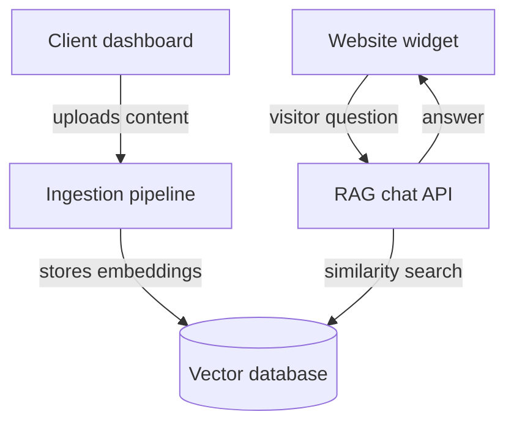

# AI Bot-as-a-Service Platform — High-Level Design (HLD)

**Author:** Jagat Pal Singh | DVIO Digital Pvt. Ltd. **Status:** Draft v1 — architecture stage, before implementation

---

## 1. Purpose of this document

This HLD describes *how* the platform will be built — the major components, how data moves through the system, how clients stay isolated from each other, and the key technical decisions. It intentionally stays at the architecture level: no code, no low-level implementation details. Those come later, once this design is agreed on.

---

## 2. Goals and non-goals

**Goals**

- Any DVIO client can upload their own content and get a working support chatbot, without a developer manually building it each time
- One platform serves many clients (multi-tenant), not one deployment per client
- Answers must come only from the client's own uploaded content — no hallucinated or generic answers
- Integration into a client's website should take one script tag, no code changes on their end

**Non-goals (for v1)**

- No voice/phone support — text chat only
- No support for structured data sources (databases, CRMs) as knowledge input — documents and web pages only
- No custom LLM fine-tuning per client — all clients share the same underlying model, personalized only through their own content
- No white-labelling / custom domains for the widget in the MVP (kept on the roadmap — planned for phase 2)

---

## 3. System overview

The platform has five major components. Two run **once per client** (setup time), and two run **on every visitor interaction** (real time). This distinction drives a lot of the design — the real-time path needs to be fast and cheap; the setup path can be slower.



| # | Component | Runs | Responsibility |
| --- | --- | --- | --- |
| 1 | Client dashboard | Setup time | Client signs up, uploads docs, configures bot, gets embed code |
| 2 | Ingestion pipeline | Setup time | Converts raw content into searchable chunks + embeddings |
| 3 | Vector database | Always-on storage | Stores embeddings, supports similarity search |
| 4 | RAG chat API | Real time (per question) | Finds relevant content, asks the LLM to answer |
| 5 | Website widget | Real time (per visitor) | Chat UI embedded on the client's site |

---

## 4. Component breakdown

### 4.1 Client dashboard

- Where a DVIO client's team logs in to manage their bot(s)
- Responsibilities: authentication, organization/team management, document upload, bot configuration (name, tone, allowed domains), viewing chat history/analytics, generating the embed snippet
- One client organization can have multiple bots (e.g., a "Support Bot" and a "Sales Bot")

### 4.2 Ingestion pipeline

- Triggered whenever a client uploads or updates content
- Responsibilities: extract text from PDFs/web pages/FAQs → split into small chunks → convert each chunk into an embedding (a numeric representation of meaning) → store in the vector database
- Runs asynchronously (as a background job), since processing large documents can take time — the dashboard should show "processing" → "ready" status rather than blocking the client

### 4.3 Vector database

- Stores every chunk's embedding, tagged with which bot/client it belongs to
- Supports similarity search: "given this visitor's question, find the most relevant stored chunks"
- Chosen approach: PostgreSQL with the `pgvector` extension — since Postgres is already in DVIO's stack, this avoids introducing and operating a separate specialized database

### 4.4 RAG chat API

- The real-time brain of the system. For every visitor question:
  1. Convert the question into an embedding
  2. Search the vector database for the most relevant chunks belonging to that specific bot
  3. Pass those chunks + the question to an LLM (Claude/GPT) with instructions to answer *only* using the given content
  4. Return the answer to the widget
- This is the component that runs most frequently and has the tightest latency/cost requirements — it needs to respond in a couple of seconds, for every single message, across every client

### 4.5 Website widget

- A small embeddable script the client pastes into their site (similar to how Intercom or Crisp work)
- Talks to the RAG chat API using the bot's public key
- No login required for the visitor — just an open chat window tied to that specific bot

---

## 5. Data flow

### 5.1 Setup flow (one-time, per document)

```
Client uploads document
  → Ingestion pipeline extracts + chunks text
  → Each chunk converted to an embedding
  → Embeddings stored in vector database, tagged with bot_id
  → Document marked "ready" in dashboard
```

### 5.2 Query flow (every visitor message)

```
Visitor types a question in the widget
  → Widget sends question + bot's public key to RAG chat API
  → API verifies the key and the requesting domain
  → API embeds the question
  → API searches vector database for top matching chunks (scoped to that bot only)
  → API sends question + matched chunks to the LLM
  → LLM generates an answer grounded in those chunks
  → Answer returned to widget, shown to visitor
```

---

## 6. Multi-tenancy and data isolation

- **Approach:** one shared database, with every row tagged by `organization_id` (directly or via `bot_id`) — not a separate database or schema per client. This keeps operations simple and cost-effective while the platform is young.
- **Isolation enforced at two levels:**
  - Application level — every query is automatically scoped to the logged-in user's organization
  - Database level — Postgres Row-Level Security (RLS) as a safety net, so even a bug in application code cannot leak one client's data to another
- **Two separate authentication paths:**
  - Dashboard login — normal email/OAuth login for the client's team
  - Widget access — no login; a public bot key + domain allow-list identifies which bot a visitor is talking to

*(Full schema and implementation detail will be covered separately when we move to the build phase.)*

---

## 7. Technology choices

| Layer | Choice | Why |
| --- | --- | --- |
| Backend/API | Python + FastAPI | Team choice for the backend/API layer |
| Database | PostgreSQL | Relational data — organizations, users, bots, documents |
| Vector database | Qdrant | Dedicated vector DB for embeddings + similarity search |
| Dashboard frontend | Next.js + TypeScript | Already in stack |
| LLM | GPT-4o (primary), swappable | Chosen for stronger built-in web search vs. alternatives |
| Embeddings | Provider TBD (OpenAI or Voyage) | Needs a short evaluation — see open questions |
| Hosting | AWS | Already in stack |
| Background jobs (ingestion) | TBD — queue system needed | See open questions |

---

## 8. Non-functional requirements

- **Latency:** RAG chat API should respond within \~2–3 seconds end-to-end for a typical question
- **Isolation:** zero cross-tenant data leakage, enforced at both app and DB level
- **Availability:** the query path (widget → chat API) is customer-facing and should be the most resilient part of the system; ingestion can tolerate brief downtime
- **Cost control:** every visitor question costs money (embedding + LLM call) — needs basic rate limiting per bot to prevent abuse or runaway costs
- **Scalability:** architecture should support many clients on shared infrastructure without per-client deployments

---

## 9. Open questions / risks

- Which embedding model/provider to standardize on (affects cost and retrieval quality)
- How to handle very large document sets per client (cost and chunking strategy)
- Background job/queue system for ingestion — needs a decision (e.g., a simple job table vs. a dedicated queue)
- Rate limiting and abuse prevention strategy for the public widget endpoint
- Pricing tiers vs. actual per-question cost (needs to be modeled once LLM/embedding costs are known)

### 9.1 Recommended answers

Working recommendations for each open question, given the chosen stack (FastAPI, PostgreSQL, Qdrant, GPT-4o). These are starting positions to confirm, not locked decisions.

| Question | Recommendation | Why |
| --- | --- | --- |
| Embedding provider | OpenAI `text-embedding-3-small` | Cheap, good enough for FAQ-style content, one vendor alongside GPT-4o for simpler billing/ops. Upgrade to Voyage only if retrieval quality is a real problem in testing. |
| Large document sets | \~500–800 token chunks, 10–15% overlap, soft per-plan upload cap | Overlap avoids losing context at chunk boundaries. A per-plan cap (enforced at ingestion, not hard-coded) keeps both LLM/embedding cost and Qdrant storage predictable per pricing tier. |
| Background jobs/queue | FastAPI `BackgroundTasks` for MVP → Redis + Celery (or lighter: RQ) once load grows | No need to stand up infra before you need it. Both are Python-native and drop into FastAPI without a rewrite later. |
| Rate limiting | Per-bot-key token bucket (Redis) + secondary per-IP limit, on top of the domain allow-list already in the design | Caps worst-case cost exposure per client even if a public key leaks or gets scraped. |
| Pricing tiers | Tier by monthly message volume (e.g. 500 / 2,000 / unlimited), not by document count | Message volume is what actually drives GPT-4o + embedding cost — document count doesn't. Exact price points still need real cost-per-message data once the pipeline is live. |

---

## 10. Next steps

1. Review and align on this HLD
2. Finalize embedding provider choice
3. Move into detailed design + implementation, starting with multi-tenant DB & auth (already scoped separately)